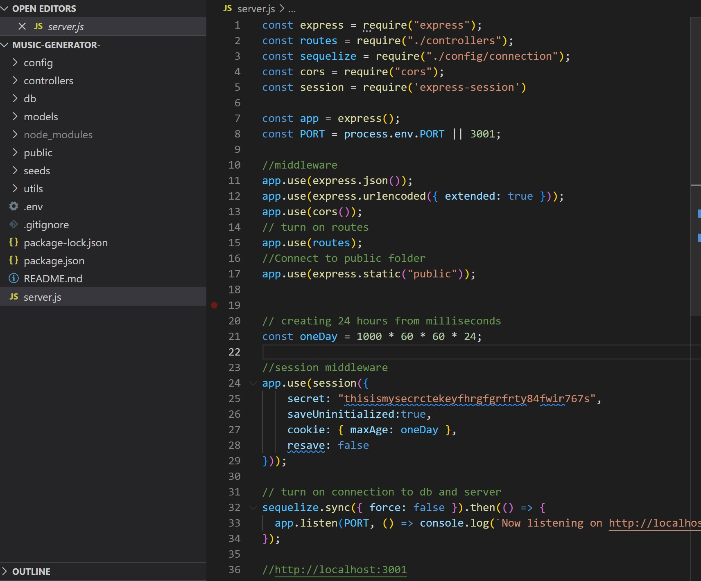

# MUSIC-GENERATOR-
A full-stack app that fetches from an API that generates music

## Description
The Bootcamp Music webpage allows user to enter their username, email address, and password to create login. Login allows access to predetermined homepage where users can access categories of music and play videos. Each video has the option for user to save songs into their playlist on local storage. User can fetch playlist data based on the stored values under My Music page. Upon reviewing playlist the user is able to play or delete as desired.

## Table of Contents
  * [Demo](#demo)  
  * [Deployment](#deployment)
  * [Questions](#questions)
  * [Technologies](#Technologies)

    ***


## Demo

Login page

​
Homepage

​
Video page

​
Music list


User playlist

​




## Technologies

- [Figma - Wireframe](https://www.figma.com/)
- [Font Awesome](https://fontawesome.com/)
- [Google Fonts](https://fonts.google.com/knowledge)
- [JQuerey](https://jquery.com/)
- [BootStrap Framework](https://getbootstrap.com/)
- [Swiper Framework - CSS/JS](https://swiperjs.com/)


## Deployment

A live demo of this application can be found here: 
 
- [Heroku:] https://bc-music-generator.herokuapp.com/
- [Local Host:] http://localhost:3001


## Installation

  To install this program, please clone the repo from GitHub: 
  
  ```
https://github.com/Sabrina-Nawaz/music-generator-.git
  ```

  
## Questions

  If you have any questions about the project you can reach out to me through my GitHub found below:

- [Sabrina-Nawaz](https://github.com/Sabrina-Nawaz)
- [Gareth Kwan](https://github.com/Gareth-Kwan)
- [Jasper Cheng](https://github.com/Hpyorange)
- [Andres Chaux](https://github.com/andres192x)
- [Jessica Osorio](https://github.com/osorioj88) 
